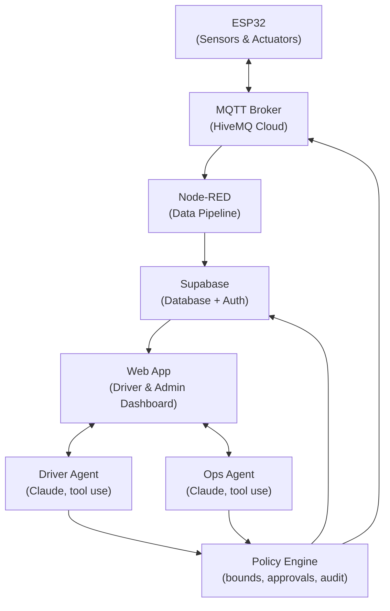

# 🅿️ Smart Parking System
> **An IoT-powered smart parking solution with autonomous AI agents — starting at SRMIST KTR, scaling to campuses everywhere.**

A fully connected IoT ecosystem that brings real-time parking intelligence to college campuses. Built first for **SRM Institute of Science and Technology, Kattankulam (KTR)**, with a roadmap to expand across institutions — combining sensor networks, cloud pipelines, and two purpose-built AI agents into one seamless experience.

---

## 🏫 Deployment Roadmap

| Phase | Campus | Status |
|---|---|---|
| **Phase 1** | SRMIST KTR | 🟡 In Development |
| **Phase 2** | Other SRM Campuses | 🔜 Planned |
| **Phase 3** | Other Colleges & Universities | 🔜 Planned |

---

## 📖 Overview

College parking is a daily pain point. Vehicles circle endlessly looking for spots, gates back up during peak hours, and there's no real-time visibility for drivers or campus administration. This system fixes that.

The Smart Parking System for SRMIST KTR provides:
- **Live slot availability** across all monitored zones
- **Automated gate control** based on real occupancy and verified entry
- **A conversational Driver Agent** for finding, booking, and managing parking in natural language
- **An autonomous Ops Agent** that manages pricing, anomalies, and gate exceptions within strict, auditable rules
- **A web dashboard** for drivers and admins

---

## ⚙️ Tech Stack

| Layer | Technology | Role |
|---|---|---|
| **Edge** | ESP32 | Sensor readings, actuator control, MQTT publishing |
| **Messaging** | HiveMQ Cloud | Secure MQTT broker (device ↔ cloud) |
| **Pipeline** | Node-RED | MQTT → Supabase data flow |
| **Backend** | Supabase (Postgres + Auth) | Database + user authentication |
| **Frontend** | Web App | Live status dashboard + gate control |
| **AI Layer** | Anthropic Claude API (tool use) | Two dedicated agents — Driver Agent and Ops Agent — sharing one tool/data layer, gated by a server-side policy engine |

---

## 🛠️ Hardware Components (Prototype)

| Component | Quantity | Function |
|---|---|---|
| HC-SR04 Ultrasonic Sensors | 4 | Detect slot occupancy (one per slot) |
| RGB / two-color LED pairs | 4 | 🟢 Free / 🔴 Occupied indicators, one per slot |
| RC522 RFID Reader | 1 | Entry vehicle ID — stand-in for ANPR in the prototype |
| Exit trigger (push button) | 1 | Simulates exit sensor; swap for a second RFID/ANPR unit in production |
| SG90 Servo Motors | 2 | Entry and exit boom barriers |
| OLED I2C Display (SSD1306) | 1 | Live free-slot count and system status |
| Buzzer | 1 | Optional audible alerts (full lot, denied entry, faults) |

> Rain-aware ceiling covers, night-mode ambient lighting, and other environment-aware hardware are strong Phase 2 additions — see [Expansion Plan](#-expansion-plan) — but aren't part of the current prototype scope.

---

## 🤖 AI Agent System

Rather than a single chatbot, the system runs **two specialized Claude-powered agents** on top of a shared data and tool layer, with every action passing through a server-side policy engine before it executes. Agents propose actions with reasoning; the policy engine independently verifies and authorizes — the LLM's judgment is never the final authority on money- or safety-relevant actions.

### 🚗 Driver Agent
Conversational, driver-facing. Handles requests like *"find me parking near the main gate for 3 hours"* by chaining tool calls:
- `search_availability` — live occupancy lookup
- `get_price_quote` — exact, bindable pricing
- `create_booking` / `cancel_booking` / `extend_booking`
- `get_directions`
- `report_issue` — logs problems for the Ops Agent, doesn't resolve them itself

Autonomous within the driver's own account and budget; anything above a configured price or refund threshold requires explicit confirmation.

### 🛠️ Ops Agent
Autonomous within defined rules for day-to-day operations:
- `get_zone_metrics` — read-only analytics, always unrestricted
- `adjust_pricing` — auto-applies within a configured tariff band and max step size; outside that, or during blackout windows (events, holidays), it queues for human approval
- `flag_anomaly` — logs sensor faults, ANPR mismatches, suspected fraud; certain categories have a forced minimum severity regardless of the agent's own assessment
- `retry_sensor` — fully autonomous, rate-limited soft resets for offline sensors
- `override_gate` — the strictest tool: auto-opens **only** when independently verified against an active, paid booking; any ambiguous case always requires human approval
- `dispatch_staff` — creates tasks for on-duty staff, auto-escalates urgent priority to an immediate alert

### 🧩 Policy Engine
A server-side rules layer, not a prompt — bounds, rate limits, blackout windows, and verification checks are config, not code, so autonomy can be tuned per zone without redeploying the agent. Every action, approved or not, writes to an immutable audit log with the agent's full reasoning trace.

---

## 🚦 System Functionalities

### 🔐 User Management
- Students and staff at SRMIST KTR register/login via Supabase Auth
- Role-based access: **Drivers** see availability and talk to the Driver Agent; **Admins** see the full control panel and Ops Agent activity

### 🅿️ Parking Slot Management
- Each slot is continuously monitored by an ultrasonic sensor
- Occupied → LED turns 🔴 &nbsp;&nbsp; Free → LED turns 🟢
- All state changes are published via MQTT and stored in Supabase

### 🚪 Gate Control
- Vehicle scans RFID tag at entrance → Driver/Ops layer verifies an active, paid booking → gate opens only on `granted` authorization
- Vehicle exits → exit trigger requests authorization → gate opens on confirmation
- Gate closes automatically after a configurable timeout
- All gate events, including any denied or escalated attempts, logged to Supabase

### 🔔 Alerts & Buzzer
- Parking full → buzzer + OLED warning
- Anomaly flagged by Ops Agent → buzzer + OLED warning for on-site staff
- All alerts published via MQTT

### 📟 OLED Display
- Real-time available slot count
- Active system status
- Alert messages

---

## 📡 MQTT Topics (HiveMQ)

| Topic | Purpose |
|---|---|
| `parking/{zone_id}/slot{n}/status` | Slot occupancy updates (`occupied` / `free`) |
| `parking/{zone_id}/entry/vehicle_id` | RFID/ANPR read at entry, forwarded for authorization |
| `parking/{zone_id}/entry/authorize` | Backend → device: `granted` / `denied` |
| `parking/{zone_id}/exit/request` | Exit trigger fired at the gate |
| `parking/{zone_id}/exit/authorize` | Backend → device: `granted` / `denied` |
| `parking/control/#` | Manual override commands |

---

## 🌐 Cloud Integration

### Node-RED
Runs a flow that subscribes to MQTT topics and pushes real-time events into Supabase.

### Supabase
Stores all persistent data:
- `users` — Registered SRMIST KTR drivers
- `bookings` — Active/past bookings, payment status
- `parking_logs` — Entry/exit event logs
- `sensor_data` — Slot and gate state history
- `agent_audit_log` — Every agent action, its reasoning, and its policy-engine outcome (`applied` / `pending_approval` / `rejected`)

### Web App
- Live slot availability via MQTT subscription
- Historical data and user auth via Supabase
- Admin panel for Ops Agent activity, pending approvals, and manual control

### Agent Backend (Claude API)
A small service exposing the tool schemas above, calling the Claude API with tool use, and enforcing the policy engine before any tool executes. Deployable as a standard FastAPI/Node service — the LLM layer swaps in cleanly regardless of host.

---

## 🚀 System Architecture



---

## 🚀 Setup & Deployment

### 1️⃣ ESP32
```cpp
// Update credentials in config.h
#define WIFI_SSID      "SRMIST_KTR_WIFI"
#define MQTT_BROKER    "your-cluster.hivemq.cloud"
#define MQTT_USER      "your_mqtt_user"
#define MQTT_PASSWORD  "your_mqtt_password"
#define TOPIC_PREFIX   "parking/zone1"
```
Flash the sketch to your ESP32 using Arduino IDE. See `parker_os_prototype/README.md` for full wiring and library setup.

### 2️⃣ HiveMQ
- Create a free [HiveMQ Cloud](https://www.hivemq.com/mqtt-cloud-broker/) account
- Copy the cluster URL, username, and password into your ESP32 config

### 3️⃣ Node-RED
```bash
# Import node-red-flow.json into your Node-RED instance
# Configure the Supabase REST node:
SUPABASE_URL = "https://your-project.supabase.co"
SUPABASE_KEY = "your_service_role_key"
```

### 4️⃣ Supabase
```sql
CREATE TABLE users (id uuid PRIMARY KEY, name text, email text, role text);
CREATE TABLE bookings (id serial PRIMARY KEY, user_id uuid, slot_id int, start_time timestamptz, end_time timestamptz, price numeric, status text, payment_status text);
CREATE TABLE parking_logs (id serial PRIMARY KEY, user_id uuid, slot_id int, entry_time timestamptz, exit_time timestamptz);
CREATE TABLE sensor_data (id serial PRIMARY KEY, slot_id int, status text, gate_open boolean, recorded_at timestamptz);
CREATE TABLE agent_audit_log (id serial PRIMARY KEY, agent text, tool_name text, input jsonb, outcome text, reasoning text, created_at timestamptz);
```
Enable Supabase Auth for registration/login.

### 5️⃣ Web App
```bash
npm install
# .env
VITE_SUPABASE_URL=...
VITE_SUPABASE_ANON_KEY=...
VITE_MQTT_BROKER=wss://your-cluster.hivemq.cloud:8884/mqtt
npm run dev
```

### 6️⃣ Agent Backend
```bash
pip install fastapi anthropic supabase uvicorn
# .env
ANTHROPIC_API_KEY=...
SUPABASE_URL=...
SUPABASE_SERVICE_KEY=...
uvicorn main:app --host 0.0.0.0 --port 8000
```
The backend registers the Driver Agent and Ops Agent tool schemas, routes every tool call through the policy engine, and logs outcomes to `agent_audit_log`.

---

## 🗺️ Expansion Plan

After validating the system at **SRMIST KTR**, the plan is to:
1. **Package the system** as a deployable kit (firmware + dashboard + agents) any campus can adopt with minimal configuration
2. **Build a multi-campus admin portal** where each college gets its own isolated namespace on shared cloud infrastructure
3. **Add predictive analytics** — peak hour forecasting and average occupancy trends per campus zone, surfaced through the Ops Agent
4. **Integrate with campus ID cards / apps** for auto check-in of registered vehicles
5. **Environment-aware hardware** — rain sensors triggering automatic ceiling covers, LDR-based night lighting — as a Phase 2 hardware add-on once the core loop is validated
6. **Real ANPR** — replace the prototype's RFID stand-in with camera-based plate recognition (ESP32-CAM or a dedicated ANPR unit) for production deployment

If you're from another college and want to pilot this — reach out!

## 📄 License
This project is licensed under the [MIT License](LICENSE).

---

<p align="center">
  <b>Built at SRMIST KTR 🏫 · Scaling to campuses everywhere 🌐</b>
</p>
